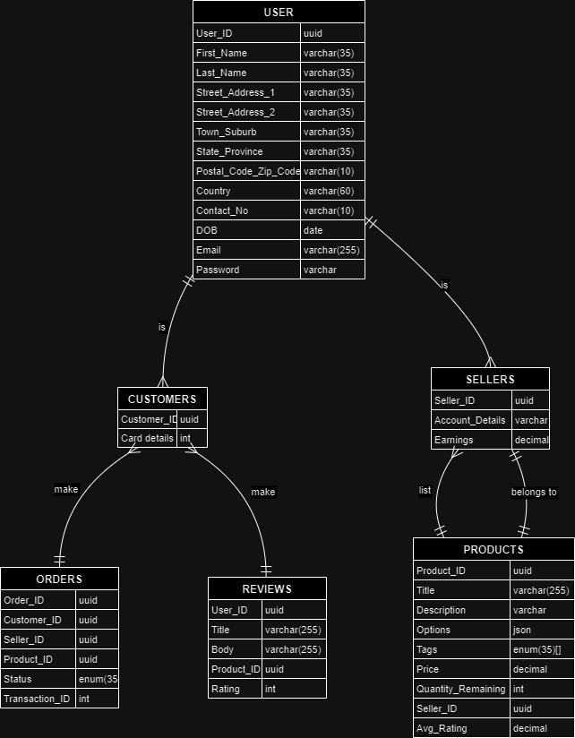

# Design

This document contains the thought process that was followed while architecting, designing and developing this project.

## Process

1. Identify the features by doing a surveying the [internet](https://www.webalive.com.au/ecommerce-website-features/).
2. Define actors, actions, and entities.
3. Architect a basic model for each actor.
4. Develop action flows and pathways.
5. Write code for each of the features.

## Goal

1. Create APIs to enable sellers to manage their products.
2. Create APIs to enable Customers to buy products.
3. Create APIs to enable the product delivery lifecycle.

## Entity sets

[Refer](https://kitefaster.com/2017/05/03/maximum-string-length-popular-database-fields)\
[Refer](https://stackoverflow.com/questions/30485/what-is-a-reasonable-length-limit-on-person-name-fields)\
[Refer](https://ux.stackexchange.com/a/100062/173550)\
[Refer](https://worldpopulationreview.com/country-rankings/country-with-the-longest-name)

Entity sets are users of our product. Actors that involved in this buy-sell cycle are 

1. User
    - Name - Single Valued - Not Nullable - Composite
        1. First Name (max_len = 35) - Single Valued - Not Nullable
        2. Last Name (max_len = 35) - Single Valued - Not Nullable
    - Address - Single Valued - Not Nullable - Composite
        1. Street Address 1 (max_len = 35) - Single Valued - Not Nullable - Simple
        2. Street Address 2 (max_len = 35) - Single Valued - Nullable - Simple
        3. Town/Suburb (max_len = 35) - Single Valued - Nullable? - Simple
        4. State/Province (Dropdown by country?) (max_len = 35) - Single Valued - Not Nullable - Simple
        5. Postal Code/Zip Code (max_len = 10) - Single Valued - Not Nullable - Simple
        6. Country (max_len = 60) - Single Valued - Not Nullable - Simple
    - Contact No (10 digits) - Single Valued? - Not Nullable - Simple
    - DOB - DD/MM/YYYY - Date - Single Valued - Not Nullable - Simple
    - email (max_len = 255) - Single Valued - Not Nullable - Simple
    - password - Single Valued - Not Nullable - Simple

2. Customers - Our customers who will purchase the products.
    - Card details - Single-Valued? - Nullable - Composite
        1. Number - Single Valued - Not Nullable - Simple
        2. Name (max_len = 255) - Single Valued - Not Nullable - Simple
        3. CVV? (3 digits) - Single Valued - Not Nullable - Simple
        4. Expiry - MM/YYYY - Date? - Single Valued - Not Nullable - Simple

3. Sellers - Those users who sell their products to the Customers
    - Account details - Single-valued? - Not Nullable - Simple
    - Earnings? - Single-valued - Derived Nullable - Simple

4. Products - Entities that are listed and ready to be sold. (Weak Entity, depends on Sellers)
    - Title - max_len = 255 - Single-valued - Not Nullable - Simple
    - Description - Single-valued - Nullable - Simple
    - Options - JSONField? - Single-valued - Nullable - Simple
    - Tags - Enum (max_len=35) - Multi-valued - Not Nullable - Simple
    - Price - (max = 999999) - Single-valued - Not Nullable - Simple
    - Quantity remaining/ quantity sold (max=10)? - Single-valued - Not Nullable - Simple
    - Seller - Foriegn key Seller ID - Single-valued - Not Nullable - Simple
    - Avg Rating (between 1 and 5) - Single-valued - Derived Nullable - Simple

## Relationships and Constraints

1. Customers make Orders - Many to Many
2. Customers make Reviews - Many to Many
3. Customer is a user
4. Seller is a user

## Relationship tables

1. Orders - defining the relationship of a Customer ordering a product. (Weak Entity, depends on Customers)
    - Customer - Foriegn key Customer ID - Single-valued - Not Nullable - Simple
    - Seller - Foriegn key Seller ID - Single-valued - Not Nullable - Simple
    - Product - Foriegn key Product ID - Single-valued - Not Nullable - Simple
    - Status (max_len = 35) - Enum - Single-valued - Not Nullable - Simple
    - Transaction ID - Single-valued - Not Nullable? - Simple

2. Reviews - defining the relationship of a Customer reviewing a product. (Weak Relationship, depends on Customer)
    - User - Foriegn key User ID - Single-valued - Not Nullable - Simple
    - Title (max_len = 255) - Single-valued - Nullable - Simple
    - Body (max_len = 255?) - Single-valued - Nullable - Simple
    - Product - Foriegn key Product ID - Single-valued - Not Nullable - Simple
    - Rating (Range between 1-5) - Single-valued - Not Nullable - Simple

## ER Diagram

## Actions

Actions are performed by actors on entities. Some defined actions are

- General User Actions -
    1. CRUD Users
    2. Authenticate and authorize (OAuth, passwordless, biometric, 2FA, Autologout)
    3. CRUD Addresses

- Seller Actions -
    1. CRUD Product
    2. List Products w/ Pagination
    3. Revenue charts

- Customer Actions -
    1. Product details, Related products, Featured/Recommended products
    2. Product Search w/ Pagination, Tags, and Filters
        - Filter type
            1. Category (clothing, electronics etc)
            2. Brand
            3. Price Range
            4. In stock
            5. Ratings
    3. Add, Remove and List items in cart
    4. Prebook, Place, List, Cancel, Track Order, Return
    5. CRUD Reviews and Ratings
    6. Share products
    7. Add, remove and view Wishlist

## Further Extensions

1. Multiple address support
2. Multiple payment mode support
3. Multiple items in an order support

## Future Ideas

1. **Product Videos**: Videos highlighting product features to increase conversions.
2. **FAQ For Products**: Addresses common pre-sales questions about products.
3. **FAQ For The Store**: Answers general questions about the store's policies.
4. **Email Opt-In**: Encourages visitors to subscribe for future sales and promotions.
5. **Push Notifications**: Keeps visitors updated with promotions via browser notifications.
6. **Chatbots**: Provides support to customers 24/7 with automated assistance.
7. **Coupon Codes**: Offers discounts to keep customers engaged during checkout.
8. **Gift Registries**: Drives sales by providing registries for special occasions.
9. **Loyalty Program**: Encourages customer retention with rewards for purchases.
10. Ads, Promotions, and New Releases
11. Carriers - Those users who will pick up the product from the seller and deliver it to the Customer.
    - Orders - Order ID
    - current order?
    - affiliations?
    - Carrier Actions -
        1. Pick up Order
        2. Deliver Order (FSM??)

## Local Development Considerations

To make development easier, I have created fixtures using the results generated from [fakestoreapi](https://fakestoreapi.com/).
